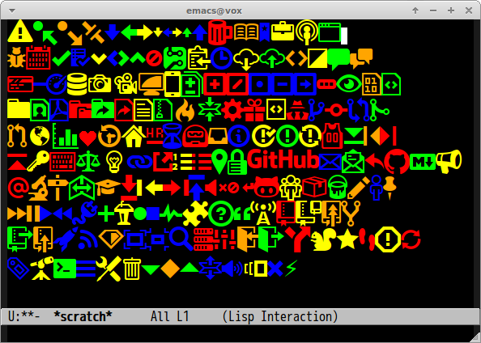

# octicons [![melpa badge][melpa-badge]][melpa-link] [![melpa stable badge][melpa-stable-badge]][melpa-stable-link]

Emacs [octicons](http://octicons.github.com/) utility.


## Installation

`octicons` is available on [MELPA](https://melpa.org/) and [MELPA stable](https://stable.melpa.org/)

You can install `octicons` with the following command.

<kbd>M-x package-install [RET] octicons [RET]</kbd>


## Requirements

- octicons font

## Function

#### `(octicons font-name)`

Return code point of `font-name`.
This function is interactive function, so you can call it by `M-x octicons`.

```lisp
(octicons "octoface")
```

## Variable

#### `octicons-alist`

`alist` whose key is font name and value is codepoint.

## Sample

```lisp
;; Generating following screenshot
(defun insert-octicons-fonts ()
  (interactive)
  (cl-loop with i = 0
           with colors = '("red" "green" "blue" "yellow" "orange")
           for (name . codepoint) in octicons-alist
           for color = (nth (random (length colors)) colors)
           do
           (let ((beg (point)))
             (insert codepoint)
             (let ((ov (make-overlay beg (point))))
               (overlay-put ov 'face `(:family "github-octicons" :foreground  ,color :height 2.0)))
             (when (= (% i 18) 17)
               (insert "\n"))
             (cl-incf i))))
```



[melpa-link]: https://melpa.org/#/octicons
[melpa-stable-link]: https://stable.melpa.org/#/octicons
[melpa-badge]: https://melpa.org/packages/octicons-badge.svg
[melpa-stable-badge]: https://stable.melpa.org/packages/octicons-badge.svg
